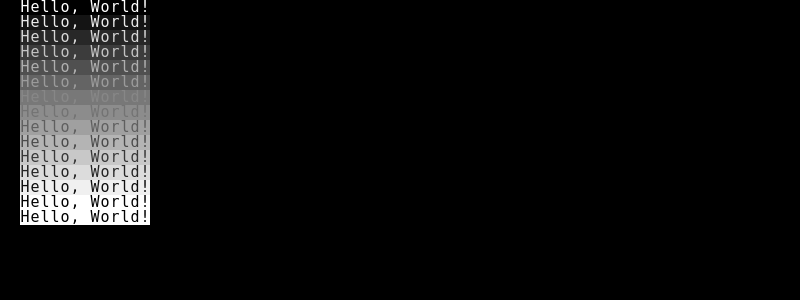

# jsrogue2

A roguelike game developed in JavaScript, utilizing modern JS features. This project is a reimplementation/fork of the initial rot.js tutorial which is now outdated as of 2013. 
The goal of this project is to make developing a Roguelike in Javascript relatively straightforward for beginners to follow. Each portion of the Roguelike will be created incrementally in separate branches, and each section will slowly help guide you to build your very own Roguelike game. 

[Live demo](https://edgar-montano.github.io/jsrogue2/)

## Part 1 - Hello, Rogue! Setting up rot.js. 

This section will guide you through on how to setup your own Hello, Rogue display screen.  As any 'Hello, World' application, the point of this is to ensure that you have a working development environment.

Whats New: 
    - imports and destructuring
    - live servering in vscode

#### Credit

This project is inspired by [codingcookies - guide to building a roguelike in js](http://www.codingcookies.com/2013/04/01/building-a-roguelike-in-javascript-part-1/) &
[roguebasin - guide to building a roguelike in js](http://www.roguebasin.roguelikedevelopment.org/index.php?title=Rot.js_tutorial), both projects unfortunately are now outdated and don't utilize JS features such as arrow functions, classes, etc; making it relatively difficult for someone just getting into Javascript to easily pick up and develop their own Roguelike. 
